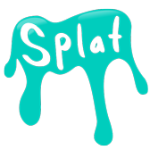

A 2d HTML5 Canvas game engine

Splat ECS is a 2d game engine made for creating multi-platform games entirely in JavaScript. Splat ECS is built around the [Entity Component System](https://github.com/ericlathrop/entity-component-system) pattern, which is flexible and promotes composition of behaviors.

# Features

* Rectangles!
* Keyboard, mouse, touch, & gamepad input
* Sounds and music (Web Audio API and HTML5 Audio)
* Sprite animation
* Asset loading, and built-in loading screen
* Games work well on phones, tablets, and desktop browsers.
* A\* Pathfinding
* Particles
* Tiled map editor support
* Easing

# Supported (tested) Platforms

* Chrome (desktop & mobile)
* Firefox
* Internet Explorer (desktop & mobile)
* Safari (desktop & mobile)
* Mac using [Electron](https://github.com/atom/electron)
* Linux x64 using [Electron](https://github.com/atom/electron)
* iOS using [Ejecta](http://impactjs.com/ejecta)
* Chrome Web Store

Splat ECS works in PhoneGap/Cordova, but it seems like the apps it produces lack hardware acceleration, making games unplayable.
Splat ECS may or may not work on other platforms, please let us know what you find out.

# Create a new Game (recommended)

<<<<<<< HEAD
* 3.1.0 [uncompressed](https://splatjs.github.io/download/splat-3.1.0.js) - [minified](https://splatjs.github.io/download/splat-3.1.0.min.js)
=======
[Fork the starter project](https://github.com/SplatJS/splat-ecs-starter-project)
>>>>>>> upstream/master

# Install through [NPM](https://www.npmjs.org)

```
$ npm install --save splat-ecs
```
<<<<<<< HEAD
Create a file named game.js and start your game with this code:
```javascript
"use strict";
var Splat = require("splat");

var canvas = document.getElementById("canvas");

var manifest = {
	"images": {},
	"sounds": {},
	"fonts": {},
	"animations": {}
};

var game = new Splat.Game(canvas, manifest);

game.scenes.add("title", new Splat.Scene(canvas, function() {
	// Initiaization
},function(elapsedMillis) {
	// Simulation
}, function(context) {
	// Draw
}));

game.scenes.switchTo("loading"); // Start loading scene which will switch to 'title' scene when all the assets in manifest are loaded.
```

Install [browserify](http://browserify.org/)
```
$ npm install --save-dev browserify
```

Then use browserify to bundle your game as a single JavaScript file for the browser.
```
$ browserify game.js -o index.js
```

Include canvas element with id "canvas" and bundled JavaScript file (Splat + Game) on your html page:
```html
<canvas id="canvas" width="1136" height="640"></canvas>
<script type="text/javascript" src="index.js"></script>
=======
Then require Splat ECS into your game:
```
var Splat = require("splat-ecs");
>>>>>>> upstream/master
```

# Games using Splat ECS

* [Splat ECS starter project](https://github.com/SplatJS/splat-ecs-starter-project)
* [Polymorphic](https://github.com/RiseAndShineGames/Polymorphic)
* [Electropolis](https://github.com/twoscoopgames/electropolis)
* [Cluster Junk](https://github.com/TwoScoopGames/Cluster-Junk)
* [Zen Madness](https://github.com/aquisenberry/ggj_meditate)
* [Treatment and Control](https://github.com/TwoScoopGames/Treatment-and-Control)
* [Uprooted](https://github.com/TwoScoopGames/ld32)
* [The Day the World Changed](https://github.com/TwoScoopGames/ggj15)

Send a pull request to add your game to the list!
